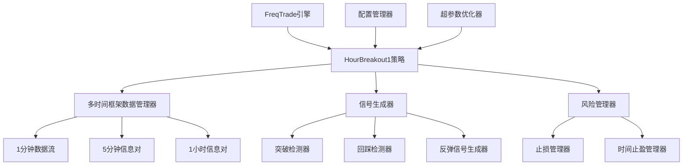
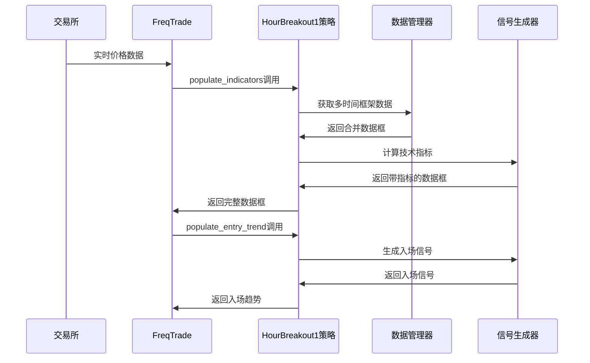

# 设计文档

## 概述

HourBreakout1是一个基于FreqTrade框架的多时间框架突破割头皮策略。该策略通过分析1小时、5分钟和1分钟三个时间框架的价格行为，识别突破-回踩-反弹的交易模式，实现短期价格动量的捕获。

策略核心逻辑：
1. **突破识别**: 5分钟收盘价突破前1小时最高价
2. **回踩确认**: 1分钟价格回踩至MA5支撑位
3. **反弹入场**: 1分钟价格从MA5反弹时做多入场
4. **风险控制**: 基于1小时最高价的止损和基于时间的止盈

## 架构

### 系统架构图



### 数据流架构



## 组件和接口

### 核心组件

#### 1. 策略主类 (HourBreakout1)
```python
class HourBreakout1(IStrategy):
    """
    多时间框架突破割头皮策略
    继承FreqTrade的IStrategy基类
    """
    
    # 策略配置
    INTERFACE_VERSION = 3
    timeframe = '1m'  # 主时间框架
    
    # 可优化参数
    ma_period = IntParameter(3, 10, default=5)
    exit_minutes = IntParameter(5, 60, default=15)
    
    # 必需方法
    def informative_pairs(self) -> List[Tuple[str, str]]
    def populate_indicators(self, dataframe: DataFrame, metadata: dict) -> DataFrame
    def populate_entry_trend(self, dataframe: DataFrame, metadata: dict) -> DataFrame
    def populate_exit_trend(self, dataframe: DataFrame, metadata: dict) -> DataFrame
```

#### 2. 多时间框架数据管理器
```python
class MultiTimeframeDataManager:
    """
    管理多时间框架数据的获取和合并
    """
    
    def get_informative_pairs(self) -> List[Tuple[str, str]]
    def merge_informative_data(self, dataframe: DataFrame, metadata: dict) -> DataFrame
    def calculate_1h_high(self, dataframe: DataFrame) -> Series
    def align_timeframes(self, main_df: DataFrame, info_df: DataFrame) -> DataFrame
```

#### 3. 技术指标计算器
```python
class IndicatorCalculator:
    """
    计算策略所需的技术指标
    """
    
    def calculate_ma(self, dataframe: DataFrame, period: int) -> Series
    def calculate_breakout_condition(self, dataframe: DataFrame) -> Series
    def calculate_pullback_condition(self, dataframe: DataFrame) -> Series
    def calculate_rebound_condition(self, dataframe: DataFrame) -> Series
```

#### 4. 信号生成器
```python
class SignalGenerator:
    """
    生成入场和出场信号
    """
    
    def generate_entry_signals(self, dataframe: DataFrame) -> DataFrame
    def generate_exit_signals(self, dataframe: DataFrame) -> DataFrame
    def validate_signal_conditions(self, dataframe: DataFrame) -> Series
    def prevent_duplicate_entries(self, dataframe: DataFrame) -> Series
```

#### 5. 风险管理器
```python
class RiskManager:
    """
    管理止损和止盈逻辑
    """
    
    def calculate_stop_loss(self, dataframe: DataFrame) -> Series
    def calculate_time_based_exit(self, dataframe: DataFrame, entry_time: datetime) -> bool
    def update_trailing_stop(self, dataframe: DataFrame) -> Series
    def validate_risk_parameters(self, params: dict) -> bool
```

### 接口定义

#### FreqTrade接口实现
- **informative_pairs()**: 定义需要的信息对（5分钟和1小时时间框架）
- **populate_indicators()**: 计算所有技术指标和条件
- **populate_entry_trend()**: 生成做多入场信号
- **populate_exit_trend()**: 生成出场信号

#### 数据接口
- **输入**: OHLCV数据（1分钟、5分钟、1小时）
- **输出**: 带有入场/出场信号的DataFrame
- **中间数据**: 技术指标、条件标志、信号状态

## 数据模型

### 主数据框架构
```python
# 主数据框列结构
columns = {
    # 基础OHLCV数据
    'date': datetime,
    'open': float,
    'high': float, 
    'low': float,
    'close': float,
    'volume': float,
    
    # 信息对数据
    'close_5m': float,      # 5分钟收盘价
    'high_1h': float,       # 1小时最高价
    'high_1h_prev': float,  # 前1小时最高价
    
    # 技术指标
    'ma5': float,           # 5周期移动平均线
    
    # 条件标志
    'breakout_condition': bool,    # 突破条件
    'pullback_condition': bool,    # 回踩条件
    'rebound_condition': bool,     # 反弹条件
    
    # 信号列
    'enter_long': int,      # 做多入场信号
    'exit_long': int,       # 出场信号
    'enter_tag': str,       # 入场标签
    'exit_tag': str,        # 出场标签
}
```

### 状态管理模型
```python
# 策略状态跟踪
class StrategyState:
    breakout_active: bool = False      # 突破状态是否激活
    pullback_completed: bool = False   # 回踩是否完成
    entry_time: Optional[datetime] = None  # 入场时间
    entry_price: float = 0.0          # 入场价格
    stop_loss_price: float = 0.0      # 止损价格
    last_1h_high: float = 0.0         # 最新1小时最高价
```

### 参数配置模型
```python
# 策略参数
class StrategyParams:
    ma_period: int = 5              # MA周期
    exit_minutes: int = 15          # 时间止盈分钟数
    min_breakout_pct: float = 0.001 # 最小突破百分比
    pullback_tolerance: float = 0.0005  # 回踩容忍度
```

## 正确性属性

*属性是一个特征或行为，应该在系统的所有有效执行中保持为真——本质上是关于系统应该做什么的正式陈述。属性作为人类可读规范和机器可验证正确性保证之间的桥梁。*

现在我需要使用prework工具来分析验收标准的可测试性：
基于预工作分析，我将验收标准转换为可测试的正确性属性：

### 属性 1: 多时间框架数据对齐
*对于任何* 有效的多时间框架数据集，合并后的数据框应该保持正确的时间戳对齐，且不丢失关键数据点
**验证: 需求 1.4**

### 属性 2: 突破条件检测
*对于任何* 5分钟和1小时价格数据组合，当5分钟收盘价高于前1小时最高价时，突破条件应该被正确标记为真
**验证: 需求 2.2, 2.3**

### 属性 3: 回踩条件检测
*对于任何* 1分钟价格数据和MA5值，当收盘价低于或等于MA5，或最低价触及MA5时，回踩条件应该被正确标记
**验证: 需求 3.3, 3.4**

### 属性 4: 三阶段入场逻辑
*对于任何* 市场数据，只有当突破、回踩和反弹三个条件都满足时，才应该生成入场信号
**验证: 需求 4.3**

### 属性 5: 重复入场防护
*对于任何* 突破形态，同一个突破事件不应该产生多个入场信号
**验证: 需求 4.5**

### 属性 6: 止损管理
*对于任何* 开仓位置，止损价格应该设置在前1小时最高价，并在价格跌破时触发出场
**验证: 需求 5.1, 5.2**

### 属性 7: 时间止盈机制
*对于任何* 持仓，当持仓时间达到配置的N分钟时，应该触发止盈出场
**验证: 需求 6.2**

### 属性 8: MA计算正确性
*对于任何* 价格序列，5周期移动平均线应该正确计算为最近5个收盘价的算术平均值
**验证: 需求 3.1**

### 属性 9: 状态管理一致性
*对于任何* 策略状态变化，突破状态应该在正确的条件下激活、维持和重置
**验证: 需求 2.4, 3.5**

### 属性 10: 数据框兼容性
*对于任何* 输出数据框，应该包含FreqTrade要求的所有必需列，并遵循正确的命名约定
**验证: 需求 7.4**

### 属性 11: 参数验证
*对于任何* HyperOpt优化参数，值应该在定义的有效范围内，并通过验证检查
**验证: 需求 9.5**

### 属性 12: 回测信号一致性
*对于任何* 历史数据集，回测模式下生成的信号应该与相同数据在实时模式下的信号保持一致
**验证: 需求 8.3**

## 错误处理

### 数据错误处理
- **缺失数据**: 当历史数据不足时，策略应该跳过信号生成而不是崩溃
- **数据质量**: 检测异常价格数据（如零值、负值）并记录警告
- **时间框架不匹配**: 处理不同时间框架数据的时间戳不对齐问题

### 计算错误处理
- **除零错误**: 在计算百分比变化时检查分母为零的情况
- **数值溢出**: 处理极端价格值可能导致的计算溢出
- **NaN值处理**: 确保技术指标计算中的NaN值不会传播到信号生成

### 交易错误处理
- **无效信号**: 验证入场/出场信号的有效性，过滤无效信号
- **风险检查失败**: 当风险检查失败时，阻止交易执行并记录原因
- **参数边界**: 确保所有参数在有效范围内，超出范围时使用默认值

### 错误恢复策略
```python
def handle_calculation_error(self, error: Exception, context: str) -> None:
    """
    统一的错误处理机制
    """
    self.logger.error(f"计算错误在 {context}: {str(error)}")
    # 记录错误但不中断策略执行
    # 使用安全的默认值继续运行
```

## 测试策略

### 双重测试方法
策略将采用单元测试和基于属性的测试相结合的方法：

**单元测试**：
- 验证特定示例和边界情况
- 测试集成点和错误条件
- 验证FreqTrade接口实现的正确性

**基于属性的测试**：
- 验证跨所有输入的通用属性
- 通过随机化实现全面的输入覆盖
- 每个属性测试最少运行100次迭代

### 测试框架配置
- **测试库**: pytest用于单元测试，hypothesis用于基于属性的测试
- **最小迭代次数**: 每个属性测试100次迭代（由于随机化）
- **测试标签格式**: **功能: hour-breakout-scalping, 属性 {编号}: {属性文本}**

### 测试覆盖范围
1. **核心逻辑测试**: 突破检测、回踩识别、反弹信号
2. **多时间框架测试**: 数据合并、时间对齐、指标计算
3. **风险管理测试**: 止损触发、时间止盈、参数验证
4. **集成测试**: FreqTrade兼容性、回测一致性、HyperOpt支持
5. **边界情况测试**: 数据缺失、极端值、错误条件

### 测试数据生成
- **价格数据生成器**: 生成符合市场特征的随机OHLCV数据
- **多时间框架生成器**: 确保不同时间框架数据的一致性
- **边界情况生成器**: 专门生成边界和错误条件的测试数据

每个正确性属性必须通过单独的基于属性的测试实现，并引用其设计文档属性编号。